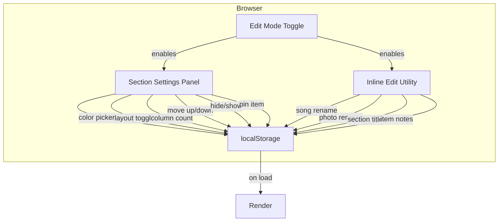

# Design Document: Edit Mode Enhancements

## Overview

This feature adds comprehensive editing capabilities to Edit Mode, organized into four areas: content editing (inline rename, notes), visual customization (section colors, ordering), media management (pinned items), and layout control (grid/list toggle, columns, visibility). All features are gated behind the `dev-mode-active` class and persist via localStorage.

### Key Design Decisions

1. **Section Settings Panel**: Each section gets a collapsible toolbar (`.section-settings-panel`) injected at the top when Edit Mode is active. This panel contains color picker, layout toggle, column selector, move up/down buttons, and hide button — keeping all section-level controls in one place.
2. **Inline Edit Pattern**: A reusable `makeInlineEditable(element, storageKey, itemId, options)` utility handles the click-to-edit, Enter/Escape/blur behavior for all inline editing (songs, photos, titles).
3. **Dedicated localStorage keys**: Each feature uses its own key to avoid conflicts: `song_renames`, `photo_renames`, `section_titles`, `item_notes`, `section_colors`, `section_order`, `pinned_items`, `section_layouts`, `section_columns`, `hidden_sections`.
4. **CSS-driven layout switching**: Grid/list modes use CSS classes (`.layout-grid`, `.layout-list`) on the section container, with column count set via CSS custom property `--grid-columns`.
5. **Section ordering via DOM manipulation**: On load, sections are reordered by reading `section_order` and using `insertBefore` to rearrange them within `.memories-content`.

## Architecture



## Components and Interfaces

### 1. Inline Edit Utility

```javascript
function makeInlineEditable(element, options) {
  // options: { storageKey, itemId, field, multiline, placeholder }
  // On click (if edit mode active): replace textContent with <input> or <textarea>
  // On Enter/blur: save to localStorage[storageKey][itemId][field], restore display
  // On Escape: discard, restore original text
}
```

### 2. Section Settings Panel

Injected into each `.section` div when Edit Mode activates:

```html
<div class="section-settings-panel">
  <div class="ssp-group ssp-color">
    <label>🎨</label>
    <input type="color" class="ssp-color-picker">
    <button class="ssp-color-reset">Reset</button>
  </div>
  <div class="ssp-group ssp-layout">
    <button class="ssp-grid-btn" title="Grid view">▦</button>
    <button class="ssp-list-btn" title="List view">☰</button>
  </div>
  <div class="ssp-group ssp-columns">
    <label>Cols:</label>
    <input type="range" min="2" max="6" class="ssp-columns-range">
    <span class="ssp-columns-value">4</span>
  </div>
  <div class="ssp-group ssp-order">
    <button class="ssp-move-up" title="Move section up">⬆️</button>
    <button class="ssp-move-down" title="Move section down">⬇️</button>
  </div>
  <div class="ssp-group ssp-visibility">
    <button class="ssp-hide-btn" title="Hide section">👁️‍🗨️ Hide</button>
  </div>
</div>
```

### 3. Pinned Item UI

Each item gets a pin button overlay (visible only in Edit Mode):

```html
<button class="pin-item-btn" title="Pin this item">📌</button>
```

Pinned items get a `.pinned` class and a badge:
```html
<div class="pinned-badge">⭐ Featured</div>
```

### 4. Item Notes UI

Below each item, a note area:
```html
<div class="item-note" data-item-id="...">
  <span class="note-text">User's note here</span>
  <!-- or in edit mode with no note: -->
  <span class="note-placeholder">+ Add note</span>
</div>
```

## Data Models

### localStorage Keys

| Key | Type | Example |
|-----|------|---------|
| `song_renames` | `{ [songId]: { name?: string, artist?: string } }` | `{ "song1.mp3": { name: "My Song" } }` |
| `photo_renames` | `{ [photoId]: string }` | `{ "photo1.jpg": "Beach Day" }` |
| `section_titles` | `{ [sectionId]: string }` | `{ "photos-section": "Our Photos" }` |
| `item_notes` | `{ [itemId]: string }` | `{ "song1.mp3": "Our first dance" }` |
| `section_colors` | `{ [sectionId]: string }` | `{ "songs-section": "#ffe0f0" }` |
| `section_order` | `string[]` | `["songs-section", "photos-section", ...]` |
| `pinned_items` | `{ [sectionId]: string }` | `{ "photos-section": "photo1.jpg" }` |
| `section_layouts` | `{ [sectionId]: "grid" \| "list" }` | `{ "songs-section": "list" }` |
| `section_columns` | `{ [sectionId]: number }` | `{ "photos-section": 3 }` |
| `hidden_sections` | `string[]` | `["timeline-section"]` |

## Correctness Properties

### Property 1: Inline edit round-trip

*For any* item ID and any non-empty string value, after saving an inline edit, reading the value back from localStorage SHALL return the exact same string.

### Property 2: Section order is a permutation

*For any* saved section order, it SHALL be a permutation of the original section IDs (no duplicates, no missing sections).

### Property 3: Only one pinned item per section

*For any* section, the `pinned_items` store SHALL contain at most one entry per section ID.

### Property 4: Column count bounds

*For any* section, the stored column count SHALL be an integer between 2 and 6 inclusive.

### Property 5: Hidden sections subset

*For any* saved hidden sections list, it SHALL be a proper subset of all section IDs (at least one section remains visible).

## Error Handling

| Scenario | Handling |
|----------|----------|
| localStorage unavailable | Silently fail — edits won't persist but no crash |
| Invalid JSON in localStorage | Return default values (empty object/array) |
| Section ID not found in DOM | Skip that section during reorder/apply |
| Empty string for title/name | Revert to original value (don't save empty) |
| Column count out of range | Clamp to 2–6 |

## Testing Strategy

### Property-Based Tests (fast-check)
- Property 1: Generate random IDs and strings, verify round-trip
- Property 2: Generate random permutations, verify validity
- Property 3: Generate random pin operations, verify single pin per section
- Property 4: Generate random column values, verify clamping
- Property 5: Generate random hide operations, verify subset constraint

### Example-Based Tests
- Inline edit: click, type, Enter saves; Escape discards
- Section settings: color picker updates background
- Layout toggle: grid/list class applied correctly
- Section ordering: move up/down swaps correctly
- Pin/unpin: toggle behavior, only one per section
- Hide/show: visibility toggled, persists across reload
