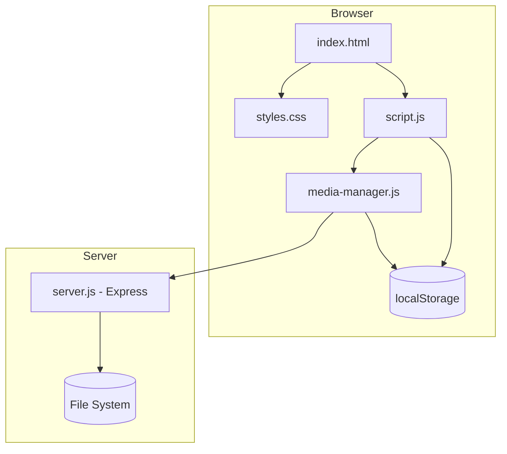

# Design Document: Media and Editor Upgrades

## Overview

This design covers 11 new capabilities for the birthday memories website, organized into two groups:

**Content & Media Enhancements:**
1. Video Upload and Display — MP4/WebM support in Photos and Funny Moments sections
2. Video Thumbnail Generation — Canvas-based first-frame extraction for video previews
3. Photo Filters — CSS filter controls (grayscale, sepia, brightness, contrast) in Edit Mode
4. Photo Frames — Birthday-themed decorative borders applied via CSS classes
5. Spotify Embed — Iframe player for Spotify tracks in the Songs section
6. YouTube Embed in Songs — Iframe player for YouTube videos in the Songs section
7. Photo Tagging — Positioned name labels on photos with percentage-based coordinates

**Edit Mode Upgrades:**
8. Undo/Redo History — History stack recording edit operations with revert/re-apply
9. Import/Export Settings — JSON backup/restore of all localStorage customization data
10. Section Templates (Custom Sections) — User-created sections with configurable layout
11. Rich Text Notes — Contenteditable editor with formatting toolbar (bold, italic, link, list)

All features integrate with the existing vanilla JavaScript architecture (no frameworks), Express server, and localStorage persistence layer. Features 3, 4, 7, 8, 10, and 11 are Edit Mode–only for editing; their results display in normal mode.

## Architecture

### High-Level Architecture



### Integration Strategy

All new features follow the existing patterns:
- **Client-side rendering**: DOM manipulation via vanilla JS in `script.js`
- **Persistence**: localStorage for user customizations, server for file uploads
- **Edit Mode gating**: Features that modify content check `document.body.classList.contains('dev-mode-active')`
- **MediaManager integration**: Video uploads extend the existing `addMedia` flow with new MIME types
- **CSS-driven styling**: Filters, frames, and rich text formatting use CSS classes/properties

### Module Responsibilities

| Module | New Responsibilities |
|--------|---------------------|
| `media-manager.js` | Video MIME validation, Spotify/YouTube-embed item creation |
| `script.js` | Video player UI, thumbnail generation, filter/frame controls, tagging UI, undo/redo, import/export, custom sections, rich text editor |
| `styles.css` | Photo frame styles, filter panel styles, tag positioning, rich text toolbar, custom section layouts |
| `server.js` | Video MIME allowlist for upload endpoints |

## Components and Interfaces

### 1. Video Upload and Display

**MediaManager Extension:**
```javascript
// New allowed video MIME types
var ALLOWED_VIDEO_TYPES = Object.freeze(['video/mp4', 'video/webm']);

// addMedia() updated to accept video files for image sections
// getMediaItems() returns items with type: 'video' alongside 'image' items
```

**Server Extension:**
```javascript
// server.js - Updated getAllowedMimes()
function getAllowedMimes(section) {
  if (IMAGE_SECTIONS.includes(section)) {
    return [...ALLOWED_IMAGE_MIMES, 'video/mp4', 'video/webm'];
  }
  // ...
}
```

**Video Player Component:**
- Thumbnail card with play button overlay in section grid
- Modal with HTML5 `<video>` element for playback
- Reuses existing `.image-modal` pattern

### 2. Video Thumbnail Generation

**Interface:**
```javascript
// Generates thumbnail from video file/URL, returns data URL
function generateVideoThumbnail(videoSource) → Promise<string|null>

// localStorage key: 'video_thumbnails'
// Structure: { [videoItemId]: dataUrlString }
function getVideoThumbnail(itemId) → string|null
function setVideoThumbnail(itemId, dataUrl) → void
```

**Implementation:** Uses off-screen `<video>` element + `<canvas>` to capture first frame at `currentTime = 0.1s`.

### 3. Photo Filters

**Interface:**
```javascript
// localStorage key: 'photo_filters'
// Structure: { [photoItemId]: { grayscale: 0-100, sepia: 0-100, brightness: 50-200, contrast: 50-200 } }
function getPhotoFilters() → Object
function setPhotoFilter(itemId, filterValues) → void
function removePhotoFilter(itemId) → void
function applyFilterToElement(imgElement, filterValues) → void
```

**Filter Panel UI:** Rendered below photo card in Edit Mode with range sliders.

### 4. Photo Frames

**Interface:**
```javascript
// localStorage key: 'photo_frames'
// Structure: { [photoItemId]: frameName }
// frameName: 'confetti' | 'balloons' | 'hearts' | 'stars' | 'cake' | null
function getPhotoFrames() → Object
function setPhotoFrame(itemId, frameName) → void
function removePhotoFrame(itemId) → void
```

**CSS Classes:** `.frame-confetti`, `.frame-balloons`, `.frame-hearts`, `.frame-stars`, `.frame-cake` applied to `.photo-card`.

### 5. Spotify Embed

**Interface:**
```javascript
// URL pattern: https://open.spotify.com/track/{TRACK_ID}[?...]
function parseSpotifyUrl(url) → { trackId: string } | null

// MediaItem with type: 'spotify-embed', metadata: { trackId }
// Rendered as: <iframe src="https://open.spotify.com/embed/track/{TRACK_ID}" height="80" width="100%">
```

### 6. YouTube Embed in Songs

**Interface:**
```javascript
// Reuses existing _parseYouTubeUrl from MediaManager
// MediaItem with type: 'youtube-embed', metadata: { videoId }
// Rendered as: song card with YouTube thumbnail + expandable iframe
```

### 7. Photo Tagging

**Interface:**
```javascript
// localStorage key: 'photo_tags'
// Structure: { [photoItemId]: [{ x: 0-100, y: 0-100, name: string }, ...] }
function getPhotoTags() → Object
function setPhotoTags(itemId, tags) → void
function addPhotoTag(itemId, tag) → void
function removePhotoTag(itemId, tagIndex) → void
```

**Tag UI:** Absolutely positioned labels within `.photo-card` using `left: x%`, `top: y%`.

### 8. Undo/Redo History

**Interface:**
```javascript
// Edit_Operation shape:
// { type: string, target: string, key: string, oldValue: any, newValue: any, timestamp: number }

var HistoryStack = {
  _undoStack: [],  // Array<Edit_Operation>
  _redoStack: [],  // Array<Edit_Operation>

  push(operation) → void,      // Records operation, clears redo stack
  undo() → Edit_Operation|null, // Pops from undo, pushes to redo, reverts
  redo() → Edit_Operation|null, // Pops from redo, pushes to undo, re-applies
  canUndo() → boolean,
  canRedo() → boolean,
  clear() → void               // Called when Edit Mode deactivates
};
```

**UI:** Undo/Redo buttons in Edit Mode toolbar, keyboard shortcuts Ctrl+Z / Ctrl+Y.

### 9. Import/Export Settings

**Interface:**
```javascript
// All localStorage keys to export:
var EXPORT_KEYS = [
  'section_titles', 'section_colors', 'section_order', 'section_layouts',
  'section_columns', 'hidden_sections', 'pinned_items', 'item_notes',
  'song_renames', 'photo_renames', 'photo_filters', 'photo_frames',
  'photo_tags', 'video_thumbnails', 'song_thumbnails', 'custom_sections',
  'developer_mode_order', 'media_manager_added', 'media_manager_trash'
];

function exportSettings() → void   // Triggers JSON file download
function importSettings(file) → Promise<void>  // Parses JSON, writes to localStorage, reloads
```

### 10. Custom Sections

**Interface:**
```javascript
// localStorage key: 'custom_sections'
// Structure: [{ id, title, layout: 'grid'|'list', itemType: 'text'|'image'|'link', items: [] }]

function getCustomSections() → Array
function addCustomSection(title, layout, itemType) → Object
function deleteCustomSection(sectionId) → void
function addItemToCustomSection(sectionId, item) → void
```

### 11. Rich Text Notes

**Interface:**
```javascript
// Replaces plain-text note editing with contenteditable + toolbar
// localStorage key: 'item_notes' (existing, now stores HTML strings)
// Allowed tags: <strong>, <em>, <a href="...">, <ul>, <li>, <br>

function createRichTextEditor(itemId, existingHtml) → HTMLElement
function sanitizeHtml(html) → string  // Strips disallowed tags/attributes
```

**Toolbar buttons:** Bold (Ctrl+B), Italic (Ctrl+I), Link, Bullet List.

## Data Models

### localStorage Schema Extensions

| Key | Type | Description |
|-----|------|-------------|
| `video_thumbnails` | `{ [itemId]: string }` | Data URL thumbnails for video items |
| `photo_filters` | `{ [itemId]: FilterValues }` | CSS filter values per photo |
| `photo_frames` | `{ [itemId]: string\|null }` | Frame name per photo |
| `photo_tags` | `{ [itemId]: Tag[] }` | Array of positioned tags per photo |
| `custom_sections` | `SectionDef[]` | Array of custom section definitions |
| `item_notes` | `{ [itemId]: string }` | HTML string (upgraded from plain text) |

### Type Definitions

```typescript
interface FilterValues {
  grayscale: number;  // 0–100
  sepia: number;      // 0–100
  brightness: number; // 50–200
  contrast: number;   // 50–200
}

interface Tag {
  x: number;    // 0–100 (percentage)
  y: number;    // 0–100 (percentage)
  name: string; // non-empty
}

interface SectionDef {
  id: string;
  title: string;
  layout: 'grid' | 'list';
  itemType: 'text' | 'image' | 'link';
  items: SectionItem[];
}

interface SectionItem {
  id: string;
  content: string;  // text content, image URL/dataURL, or link URL
  caption?: string;
}

interface EditOperation {
  type: string;       // 'inline-edit' | 'color-change' | 'layout-change' | 'pin' | 'hide' | 'reorder' | 'filter' | 'frame' | 'tag-add' | 'tag-delete'
  target: string;     // section or item ID
  key: string;        // localStorage key affected
  oldValue: any;      // value before operation
  newValue: any;      // value after operation
  timestamp: number;  // Date.now()
}

interface SpotifyEmbedItem {
  id: string;
  section: 'songs';
  source: '';
  caption: string;
  type: 'spotify-embed';
  origin: 'url-added';
  metadata: { trackId: string };
}

interface YouTubeEmbedItem {
  id: string;
  section: 'songs';
  source: '';
  caption: string;
  type: 'youtube-embed';
  origin: 'url-added';
  metadata: { videoId: string };
}
```

### MediaManager MIME Type Extension

```javascript
var ALLOWED_VIDEO_TYPES = Object.freeze(['video/mp4', 'video/webm']);
```

Added to the validation logic in `addMedia()` for image sections (photos, funnyMoments).

## Correctness Properties

*A property is a characteristic or behavior that should hold true across all valid executions of a system—essentially, a formal statement about what the system should do. Properties serve as the bridge between human-readable specifications and machine-verifiable correctness guarantees.*

### Property 1: MIME Type Validation

*For any* MIME type string and any section, the MediaManager validation function SHALL accept the file if and only if the MIME type is in the allowed list for that section (image types + video/mp4 + video/webm for image sections, audio types for songs section), and SHALL reject all other MIME types.

**Validates: Requirements 1.1, 1.2, 1.9**

### Property 2: Video Thumbnail Store Round-Trip

*For any* valid video item ID and any data URL string, storing the thumbnail via `setVideoThumbnail(id, dataUrl)` and then retrieving via `getVideoThumbnail(id)` SHALL return the original data URL. Furthermore, serializing the entire `video_thumbnails` store to JSON and deserializing SHALL produce an equivalent object.

**Validates: Requirements 2.2, 2.5**

### Property 3: Photo Filter Bounds and Persistence

*For any* photo item ID and any filter values where grayscale is in [0,100], sepia is in [0,100], brightness is in [50,200], and contrast is in [50,200], persisting the filter via `setPhotoFilter` and reading back via `getPhotoFilters` SHALL return equivalent values, and all stored values SHALL remain within their specified bounds.

**Validates: Requirements 3.3, 3.7**

### Property 4: Photo Frame Persistence Round-Trip

*For any* photo item ID and any valid frame name (one of 'confetti', 'balloons', 'hearts', 'stars', 'cake', or null), storing via `setPhotoFrame` and reading back SHALL return the same frame name.

**Validates: Requirements 4.3**

### Property 5: Spotify URL Parsing

*For any* string that is a valid Spotify track ID (22 alphanumeric characters), constructing a URL of the form `https://open.spotify.com/track/{TRACK_ID}` (with optional query parameters) and parsing it with `parseSpotifyUrl` SHALL extract the correct track ID.

**Validates: Requirements 5.1**

### Property 6: YouTube URL Parsing for Songs Section

*For any* string that is a valid YouTube video ID (11 characters from [a-zA-Z0-9_-]), constructing a URL in any supported format (youtube.com/watch?v=, youtu.be/, youtube.com/shorts/) and parsing it with `_parseYouTubeUrl` SHALL extract the correct video ID.

**Validates: Requirements 6.1**

### Property 7: Photo Tag Coordinate Bounds

*For any* click position on a photo (any non-negative pixel coordinates) and any photo dimensions (positive width and height), the computed tag coordinates SHALL have x in [0, 100] and y in [0, 100] after clamping.

**Validates: Requirements 7.2, 7.7**

### Property 8: Photo Tag Array Round-Trip

*For any* photo item ID and any array of tag objects (each with x in [0,100], y in [0,100], and a non-empty name string), storing the tags via `setPhotoTags` and reading back SHALL produce an equivalent array. Serializing to JSON and deserializing SHALL also produce an equivalent array.

**Validates: Requirements 7.3, 7.8**

### Property 9: Undo/Redo Round-Trip

*For any* sequence of edit operations pushed to the History_Stack, performing an undo followed by a redo SHALL restore the state to the value it had immediately after the original operation was pushed (undo then redo is identity).

**Validates: Requirements 8.3, 8.4, 8.9**

### Property 10: Redo Invalidation on New Operation

*For any* History_Stack state where one or more operations have been undone, pushing a new operation SHALL clear the redo stack entirely, making `canRedo()` return false.

**Validates: Requirements 8.5**

### Property 11: Import/Export Settings Round-Trip

*For any* valid localStorage state containing any subset of the export keys with JSON-serializable values, exporting to a JSON object and then importing (writing each key-value pair back to localStorage) SHALL produce an equivalent localStorage state for all exported keys.

**Validates: Requirements 9.2, 9.6, 9.9**

### Property 12: Custom Section Persistence Round-Trip

*For any* array of valid custom section definitions (each with unique id, non-empty title, valid layout, valid itemType, and items array), persisting to localStorage under `custom_sections` and reading back SHALL produce an equivalent array.

**Validates: Requirements 10.4, 10.7**

### Property 13: Custom Section Deletion

*For any* array of custom sections and any valid section ID within that array, deleting the section SHALL result in the stored array no longer containing a section with that ID, and the array length SHALL decrease by exactly one.

**Validates: Requirements 10.9**

### Property 14: HTML Sanitization Invariant

*For any* HTML string input, after applying the sanitization function, the output SHALL contain only the allowed tags (`<strong>`, `<em>`, `<a>`, `<ul>`, `<li>`, `<br>`) and no other HTML tags. The `<a>` tags SHALL retain only the `href` attribute; all other attributes on any tag SHALL be stripped.

**Validates: Requirements 11.10, 11.11**

## Error Handling

### Video Upload Errors
- **Invalid MIME type**: File is silently rejected (no error shown to user per Req 1.9)
- **Thumbnail generation failure**: Display generic video placeholder icon (Req 2.4)
- **Server upload failure**: Silently skip the file (existing pattern in MediaManager)
- **localStorage quota exceeded**: Silently fail (existing pattern)

### Embed URL Errors
- **Invalid Spotify URL format**: Display error message indicating invalid format (Req 5.6)
- **Invalid YouTube URL**: Existing behavior — `_parseYouTubeUrl` returns null, URL treated as direct media

### Import/Export Errors
- **Invalid JSON on import**: Display error message, make no changes to localStorage (Req 9.8)
- **Missing keys in import file**: Only write keys that exist in the file; don't clear keys not present
- **Export failure**: Unlikely (in-memory operation), but wrap in try/catch

### Rich Text Errors
- **Paste with disallowed HTML**: Sanitize on paste, stripping disallowed tags (Req 11.10)
- **Empty note on save**: Remove note from storage (existing behavior)

### History Stack Errors
- **Undo on empty stack**: No-op, button visually disabled (Req 8.7)
- **Redo on empty redo stack**: No-op, button visually disabled (Req 8.8)
- **Operation references deleted element**: Skip the operation gracefully

### Custom Section Errors
- **Empty title on creation**: Prevent creation, keep form open
- **Duplicate section title**: Allow (IDs are unique, titles need not be)
- **Delete confirmation cancelled**: No-op

## Testing Strategy

### Testing Framework
- **Test runner**: Vitest (already configured in `package.json`)
- **Property-based testing**: fast-check (already installed as devDependency)
- **HTTP testing**: supertest (already installed for server endpoint tests)

### Dual Testing Approach

**Unit Tests (example-based):**
- UI rendering verification (video player modal, filter panel, frame selector, tag display)
- Edit Mode gating (controls visible/hidden based on mode)
- Specific interaction flows (click photo → panel opens, click undo → state reverts)
- Edge cases (empty title rejection, invalid JSON import, thumbnail generation failure)
- Integration points (MediaManager + server for video uploads)

**Property-Based Tests:**
- Each correctness property (1–14) implemented as a single property-based test
- Minimum 100 iterations per property test
- Uses fast-check for random input generation
- Each test tagged with: `Feature: media-and-editor-upgrades, Property {N}: {title}`

### Property Test Configuration
```javascript
import { fc } from 'fast-check';

// All property tests use at least 100 iterations
const PBT_CONFIG = { numRuns: 100 };
```

### Test File Organization
```
tests/
  media-editor-property-1-mime-validation.test.js
  media-editor-property-2-thumbnail-roundtrip.test.js
  media-editor-property-3-filter-bounds.test.js
  media-editor-property-4-frame-roundtrip.test.js
  media-editor-property-5-spotify-parse.test.js
  media-editor-property-6-youtube-parse.test.js
  media-editor-property-7-tag-bounds.test.js
  media-editor-property-8-tag-roundtrip.test.js
  media-editor-property-9-undo-redo-roundtrip.test.js
  media-editor-property-10-redo-invalidation.test.js
  media-editor-property-11-import-export-roundtrip.test.js
  media-editor-property-12-custom-section-roundtrip.test.js
  media-editor-property-13-custom-section-deletion.test.js
  media-editor-property-14-html-sanitization.test.js
  media-editor-integration.test.js  (example-based tests)
```

### Key Generators for Property Tests
- **MIME types**: `fc.oneof(fc.constant('video/mp4'), fc.constant('video/webm'), fc.constant('image/jpeg'), ..., fc.string())`
- **Filter values**: `fc.record({ grayscale: fc.integer(0, 100), sepia: fc.integer(0, 100), brightness: fc.integer(50, 200), contrast: fc.integer(50, 200) })`
- **Tag coordinates**: `fc.record({ x: fc.float({ min: 0, max: 100 }), y: fc.float({ min: 0, max: 100 }), name: fc.string({ minLength: 1 }) })`
- **Spotify track IDs**: `fc.stringOf(fc.constantFrom(...'abcdefghijklmnopqrstuvwxyzABCDEFGHIJKLMNOPQRSTUVWXYZ0123456789'), { minLength: 22, maxLength: 22 })`
- **YouTube video IDs**: `fc.stringOf(fc.constantFrom(...'abcdefghijklmnopqrstuvwxyzABCDEFGHIJKLMNOPQRSTUVWXYZ0123456789_-'), { minLength: 11, maxLength: 11 })`
- **HTML strings**: `fc.string()` with random tag insertion for sanitization tests
- **Edit operations**: `fc.record({ type: fc.constantFrom('inline-edit', 'color-change', ...), target: fc.string(), key: fc.string(), oldValue: fc.string(), newValue: fc.string(), timestamp: fc.nat() })`

### Integration Tests
- Video upload via supertest (server mode)
- Custom section rendering after localStorage setup
- Import/export with actual file read/write simulation
- MediaManager.addMediaByUrl with Spotify/YouTube URLs
