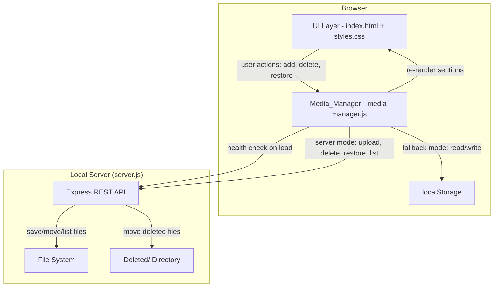

# Design Document: Media Management

## Overview

This design adds UI-based media management to the birthday website, allowing users to add, delete, and restore media items (images and songs) across all four media sections without editing code. The system uses a hybrid architecture: a local Node.js/Express server for real file operations when available, with automatic fallback to localStorage when the server is not running. This ensures the site remains fully functional in both modes.

### Key Design Decisions

1. **Hybrid storage with automatic detection**: A health-check ping at page load determines whether to use server-based file I/O or localStorage. This avoids requiring the server and keeps the site usable as a static page.
2. **Soft delete via Deleted/ directory**: Files are moved rather than permanently removed, enabling restore. This mirrors a "trash" pattern familiar to users.
3. **Single Media_Manager module**: All add/delete/restore logic lives in one JavaScript module (`media-manager.js`) that wraps both storage backends behind a common interface. The existing `script.js` render functions are extended to consume data from Media_Manager.
4. **No framework dependencies**: The project is vanilla HTML/CSS/JS, so the design stays framework-free. The server uses Node.js with Express and `multer` for file uploads.

## Architecture



### Request Flow

1. **Page load**: `Media_Manager.init()` sends a GET to `/api/health`. On success, sets `mode = 'server'`; on failure/timeout (2s), sets `mode = 'local'`.
2. **Render**: In server mode, fetches file listings from `/api/media/:section`. In local mode, merges hardcoded arrays with localStorage additions, excluding trashed items.
3. **Add**: File picker or drag-and-drop triggers file selection. In server mode, uploads via `POST /api/media/:section`. In local mode, converts to Data URL via FileReader and stores in localStorage.
4. **Delete**: Click on Delete_Button. In server mode, sends `DELETE /api/media/:section/:filename`. In local mode, adds item to localStorage trash store.
5. **Restore**: From trash UI, triggers restore. In server mode, sends `POST /api/media/restore`. In local mode, removes from trash store and re-adds to section data.

## Components and Interfaces

### 1. Media_Manager (`media-manager.js`)

The central client-side module. Exposes a public API consumed by `script.js`.

```typescript
// Conceptual interface (implemented in vanilla JS)
interface MediaManager {
  // Initialization
  init(): Promise<void>;               // Health check + initial render
  getMode(): 'server' | 'local';       // Current storage mode

  // CRUD operations
  addMedia(section: Section, files: FileList): Promise<void>;
  deleteMedia(section: Section, item: MediaItem): Promise<void>;
  restoreMedia(trashEntry: TrashEntry): Promise<void>;

  // Data access
  getMediaItems(section: Section): Promise<MediaItem[]>;
  getTrashItems(): Promise<TrashEntry[]>;

  // Section rendering triggers
  onSectionUpdated(section: Section, callback: (items: MediaItem[]) => void): void;
}

type Section = 'photos' | 'thingsYouLike' | 'funnyMoments' | 'songs';
```

### 2. Server API (`server.js`)

A lightweight Express server with the following endpoints:

| Method | Endpoint | Description |
|--------|----------|-------------|
| GET | `/api/health` | Returns `{ status: 'ok' }` for availability detection |
| GET | `/api/media/:section` | Lists files in the section directory |
| POST | `/api/media/:section` | Uploads file(s) to the section directory |
| DELETE | `/api/media/:section/:filename` | Moves file to `Deleted/:section/` |
| GET | `/api/trash` | Lists all files in `Deleted/` subdirectories |
| POST | `/api/media/restore` | Moves file from `Deleted/` back to original directory |

**Section-to-directory mapping:**

| Section | Directory |
|---------|-----------|
| photos | `Images/Memories/` |
| thingsYouLike | `Images/Liked_Things/` |
| funnyMoments | `Images/Funny_Moments/` |
| songs | `Songs/` |

### 3. UI Components

**Delete_Button**: A `<button>` with class `delete-btn` positioned absolutely in the top-right corner of each media card. Shown on hover via CSS `:hover` on the parent card. Displays "×" character.

**Add_Button**: A `<div>` styled as a card with class `add-btn-card` placed as the last item in each section grid. Displays "+" and opens a hidden `<input type="file">` on click.

**Drop_Zone**: A CSS overlay with class `drop-zone-overlay` that appears on `dragenter`/`dragover` events on each section container. Shows a dashed border and "Drop files here" text. Hidden on `dragleave`/`drop`.

### 4. Integration with Existing Code

The existing `script.js` render functions (`populatePhotos`, `populateSongs`, `populateLikes`, `populateFunnyMoments`) will be modified to:
1. Accept an items array parameter instead of reading from global arrays directly
2. Call `Media_Manager.getMediaItems(section)` to get the merged list
3. Append Delete_Button overlays to each card
4. Append Add_Button card at the end of each grid
5. Set up drag-and-drop event listeners on each section container

## Data Models

### MediaItem

```javascript
/**
 * Represents a single media item in any section.
 */
{
  id: string,           // Unique identifier (filename or generated UUID for localStorage items)
  section: string,      // 'photos' | 'thingsYouLike' | 'funnyMoments' | 'songs'
  source: string,       // File path (server mode) or Data URL (local mode)
  caption: string,      // Display name / caption
  type: string,         // 'image' | 'audio' | 'video'
  origin: string,       // 'hardcoded' | 'user-added'
  metadata: {           // Section-specific metadata
    artist?: string,    // For songs
    coverImage?: string,// For songs
    videoId?: string    // For funny moments YouTube videos
  }
}
```

### TrashEntry

```javascript
/**
 * Represents a deleted item in the trash store.
 */
{
  id: string,           // Same id as the original MediaItem
  section: string,      // Original section
  source: string,       // Original file path or Data URL
  caption: string,      // Original caption
  type: string,         // 'image' | 'audio' | 'video'
  metadata: object,     // Original metadata
  deletedAt: string     // ISO 8601 timestamp
}
```

### localStorage Keys

| Key | Type | Description |
|-----|------|-------------|
| `media_manager_added` | `MediaItem[]` | User-added items (local mode) |
| `media_manager_trash` | `TrashEntry[]` | Deleted items (local mode) |

### Server File Structure (Deleted/)

```
Deleted/
├── Images/
│   ├── Memories/
│   │   └── (deleted photo files)
│   ├── Liked_Things/
│   │   └── (deleted liked-things files)
│   └── Funny_Moments/
│       └── (deleted funny-moments files)
└── Songs/
    └── (deleted audio files)
```

### MIME Type Validation

**Allowed image types**: `image/jpeg`, `image/png`, `image/gif`, `image/webp`, `image/avif`

**Allowed audio types**: `audio/mpeg`, `audio/wav`, `audio/ogg`, `audio/mp4`, `audio/x-m4a`


## Correctness Properties

*A property is a characteristic or behavior that should hold true across all valid executions of a system — essentially, a formal statement about what the system should do. Properties serve as the bridge between human-readable specifications and machine-verifiable correctness guarantees.*

### Property 1: Delete removes item from section

*For any* media item in any section (photos, thingsYouLike, funnyMoments, songs), calling `deleteMedia(section, item)` SHALL result in that item no longer appearing in the list returned by `getMediaItems(section)`.

**Validates: Requirements 1.5, 2.3**

### Property 2: Delete in local mode populates trash with required fields

*For any* media item deleted while in local mode, the Trash_Store in localStorage SHALL contain an entry with the item's original `section`, `source`, `caption`, `type`, and a valid ISO 8601 `deletedAt` timestamp.

**Validates: Requirements 1.7, 2.5, 3.3**

### Property 3: Delete-then-restore round-trip

*For any* media item in any section, deleting the item and then restoring it SHALL result in the item reappearing in `getMediaItems(section)` and being removed from the trash store. The restored item's `section`, `source`, and `caption` SHALL equal the original values.

**Validates: Requirements 3.5, 3.6**

### Property 4: JSON serialization round-trip

*For any* valid MediaItem or TrashEntry object, `JSON.parse(JSON.stringify(obj))` SHALL produce an object deeply equal to the original.

**Validates: Requirements 3.7, 10.3**

### Property 5: Song name derived from filename

*For any* audio file added as a song, the resulting song entry's name SHALL equal the original filename with its extension removed, and the artist SHALL be "User Added".

**Validates: Requirements 5.5**

### Property 6: MIME type filtering rejects disallowed types

*For any* file with a MIME type not in the allowed set for the target section (image types for image sections, audio types for songs), the system SHALL reject the file without adding it to the section and without throwing an error.

**Validates: Requirements 6.4, 7.4, 8.8**

### Property 7: Merged list on reload equals hardcoded plus added minus trashed

*For any* combination of hardcoded items, user-added items in localStorage, and trashed items in localStorage, after a simulated page reload in local mode, `getMediaItems(section)` SHALL return exactly the union of hardcoded items and user-added items, minus any items present in the trash store.

**Validates: Requirements 1.8, 2.6, 4.8, 5.7, 10.2**

### Property 8: Server returns 404 for non-existent files

*For any* randomly generated filename that does not exist on disk, a DELETE request to `/api/media/:section/:filename` SHALL return HTTP 404 with a response body containing a descriptive error message.

**Validates: Requirements 8.7**

## Error Handling

### Client-Side (Media_Manager)

| Scenario | Handling |
|----------|----------|
| Health check fails or times out (>2s) | Fall back to localStorage mode silently. No error shown to user. |
| localStorage unavailable or throws | Render only hardcoded arrays. Log warning to console. No user-facing error. |
| localStorage quota exceeded on add | Show a brief toast notification: "Storage full. Start the server for unlimited storage." Reject the add operation. |
| File read error (FileReader) | Skip the failed file, continue processing remaining files. Log warning to console. |
| Server upload fails (network error) | Show a brief toast notification: "Upload failed. Please try again." Do not add item to section. |
| Server delete fails | Show a brief toast notification: "Delete failed. Please try again." Do not remove item from section. |
| Server restore fails | Show a brief toast notification: "Restore failed. Please try again." Keep item in trash. |
| Invalid file type dropped/selected | Silently ignore the file. No error message displayed. |
| Drag-and-drop not supported by browser | Add_Button file picker still works as primary add mechanism. Drop zone simply not shown. |

### Server-Side (Local_Server)

| Scenario | HTTP Status | Response |
|----------|-------------|----------|
| File not found on delete/restore | 404 | `{ error: "File not found", path: "..." }` |
| Invalid MIME type on upload | 400 | `{ error: "File type not allowed", mimeType: "..." }` |
| Section directory does not exist | 404 | `{ error: "Section not found", section: "..." }` |
| File system write error | 500 | `{ error: "Failed to save file", details: "..." }` |
| File already exists on upload | 409 | `{ error: "File already exists", filename: "..." }` |
| Missing required fields in request | 400 | `{ error: "Missing required field", field: "..." }` |

## Testing Strategy

### Dual Testing Approach

This feature uses both unit/example-based tests and property-based tests for comprehensive coverage.

**Property-Based Testing Library**: [fast-check](https://github.com/dubzzz/fast-check) — the standard PBT library for JavaScript/TypeScript.

**Test Runner**: A lightweight test runner (e.g., Node.js built-in test runner or Vitest) since the project has no existing test framework.

### Property-Based Tests

Each correctness property maps to a single property-based test with a minimum of 100 iterations.

| Property | Test Description | Tag |
|----------|-----------------|-----|
| Property 1 | Generate random MediaItems, delete one, verify removal | Feature: media-management, Property 1: Delete removes item from section |
| Property 2 | Generate random MediaItems, delete in local mode, verify trash entry fields | Feature: media-management, Property 2: Delete in local mode populates trash with required fields |
| Property 3 | Generate random MediaItems, delete then restore, verify round-trip | Feature: media-management, Property 3: Delete-then-restore round-trip |
| Property 4 | Generate random MediaItem and TrashEntry objects, JSON round-trip | Feature: media-management, Property 4: JSON serialization round-trip |
| Property 5 | Generate random filenames with extensions, verify song name derivation | Feature: media-management, Property 5: Song name derived from filename |
| Property 6 | Generate random MIME types, verify disallowed types are rejected | Feature: media-management, Property 6: MIME type filtering rejects disallowed types |
| Property 7 | Generate random hardcoded/added/trashed item sets, verify merge logic | Feature: media-management, Property 7: Merged list on reload equals hardcoded plus added minus trashed |
| Property 8 | Generate random non-existent filenames, verify 404 response | Feature: media-management, Property 8: Server returns 404 for non-existent files |

### Unit / Example-Based Tests

| Area | Tests |
|------|-------|
| Delete button visibility | Hover shows button, unhover hides it (Requirements 1.1–1.4, 2.1) |
| Playback stop on delete | Deleting a playing song stops audio (Requirement 2.2) |
| Add button presence | Each section has an add button (Requirements 4.1–4.3, 5.1) |
| File picker filter | Image sections filter to image types, songs to audio types (Requirements 4.4, 5.2) |
| Health check behavior | Successful check → server mode, failed → local mode, timeout ≤ 2s (Requirements 9.1–9.4) |
| localStorage failure | Graceful degradation to hardcoded-only rendering (Requirement 10.4) |
| Drop zone visibility | Dragenter shows overlay, dragleave hides it (Requirements 6.1, 6.5, 7.1, 7.5) |
| Drop triggers add | Dropping files calls the same add logic as file picker (Requirements 6.2, 7.2) |

### Integration Tests

| Area | Tests |
|------|-------|
| Server upload | POST file to each section endpoint, verify file saved to correct directory (Requirements 4.5, 5.3, 8.2) |
| Server delete | DELETE file, verify moved to Deleted/ with correct sub-directory (Requirements 1.6, 2.4, 3.1, 8.3) |
| Server restore | POST restore, verify file moved back to original directory (Requirements 3.4, 8.4) |
| Server list | GET each section and trash, verify correct file listings (Requirements 8.5, 8.6) |
| Static file serving | GET index.html, verify 200 response (Requirement 8.1) |
| Server mode rendering | Mock server with listings, verify sections render server data (Requirement 10.1) |
