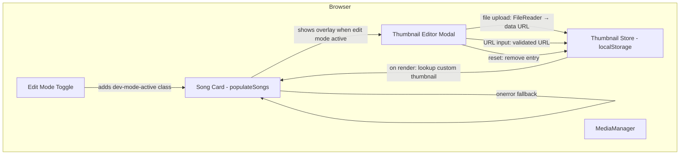

# Design Document: Song Thumbnail Customization

## Overview

This feature adds the ability for users to customize song cover images (thumbnails) in the Songs section. When Edit Mode is active, an overlay icon appears on each song's cover image. Clicking it opens a Thumbnail Editor modal where the user can upload an image file, paste an image URL, or reset to the default cover. Custom thumbnails persist in localStorage under a dedicated key and are applied during song card rendering.

### Key Design Decisions

1. **Dedicated localStorage key (`song_thumbnails`)**: Custom thumbnails are stored separately from the `media_manager_added` store as a simple `{ songId: imageUrl }` map. This avoids polluting the MediaManager's data model and makes lookups O(1).
2. **Data URL for file uploads**: Uploaded image files are converted to base64 data URLs client-side. This avoids server dependency for thumbnail storage and keeps the feature fully functional in local mode.
3. **Simple modal UI**: The Thumbnail Editor is a lightweight modal with three actions: upload file, paste URL, or reset to default. No complex cropping or editing.
4. **Edit Mode gating**: The thumbnail overlay and click handler only activate when `dev-mode-active` class is on the body, consistent with other edit features.
5. **Fallback on error**: If a custom thumbnail fails to load (broken URL, corrupted data URL), the `` element's `onerror` handler reverts to the song's original default cover image.

## Architecture



### Flow

1. **Render**: `populateSongs` checks `song_thumbnails` in localStorage for each song ID. If a custom thumbnail exists, it uses that as the `` src instead of the default `coverImage`.
2. **Edit trigger**: When Edit Mode is active, a camera/edit overlay icon is shown on each song cover. Clicking it opens the Thumbnail Editor modal for that song.
3. **Set thumbnail (file)**: User picks an image file → validated against allowed MIME types → read as data URL via FileReader → stored in `song_thumbnails[songId]` → song card `` src updated immediately.
4. **Set thumbnail (URL)**: User enters a URL → validated as http/https → stored in `song_thumbnails[songId]` → song card `` src updated immediately.
5. **Reset**: User clicks "Reset to Default" → entry removed from `song_thumbnails` → song card `` src reverted to original `metadata.coverImage`.

## Components and Interfaces

### 1. Thumbnail Store (`song_thumbnails` localStorage key)

A simple JSON object mapping song IDs to custom image sources.

```typescript
// Conceptual interface
interface ThumbnailStore {
  [songId: string]: string; // data URL or http(s) URL
}

// Functions (added to script.js)
function getCustomThumbnail(songId: string): string | null;
function setCustomThumbnail(songId: string, imageSource: string): void;
function removeCustomThumbnail(songId: string): void;
function getAllCustomThumbnails(): ThumbnailStore;
```

### 2. Thumbnail Editor Modal

A modal dialog with the following structure:

```html
<div class="thumbnail-editor-modal">
  <div class="thumbnail-editor-content">
    <h3>Change Cover Image</h3>
    <div class="thumbnail-editor-preview">
      
    </div>
    <div class="thumbnail-editor-actions">
      <button class="thumbnail-upload-btn">📁 Upload Image</button>
      <input type="file" accept="image/jpeg,image/png,image/gif,image/webp,image/avif" hidden>
      <div class="thumbnail-url-input-group">
        <input type="text" placeholder="Paste image URL (https://...)" class="thumbnail-url-input">
        <button class="thumbnail-url-btn">Set URL</button>
      </div>
      <button class="thumbnail-reset-btn">↩️ Reset to Default</button>
    </div>
    <p class="thumbnail-error"></p>
    <button class="thumbnail-close-btn">Cancel</button>
  </div>
</div>
```

### 3. Thumbnail Overlay (on Song Card)

When Edit Mode is active, each song card's cover image gets an overlay:

```html
<div class="song-cover-wrapper">
  
  <div class="thumbnail-overlay">📷</div>
</div>
```

The overlay is shown/hidden via CSS based on the `dev-mode-active` class on `<body>`.

### 4. Modified `populateSongs` function

The existing function is extended to:
- Wrap the `` in a `.song-cover-wrapper` div
- Add the `.thumbnail-overlay` element
- Look up custom thumbnails from localStorage before using the default
- Attach click handler on the wrapper (gated by edit mode) to open the editor
- Add `onerror` handler on the `` for fallback

### 5. MIME Type Validation

Reuses the existing `ALLOWED_IMAGE_TYPES` constant from MediaManager:
```javascript
['image/jpeg', 'image/png', 'image/gif', 'image/webp', 'image/avif']
```

### 6. URL Validation

Reuses the existing `MediaManager._isValidUrl()` helper which checks for http:// or https:// prefix and URL parseability.

## Data Models

### localStorage: `song_thumbnails`

```json
{
  "Songs/Aktimel%20%26%20LED%20Lights%20(Happy%20Birthday%20Or).mp3": "data:image/png;base64,iVBOR...",
  "https://www.soundhelix.com/examples/mp3/SoundHelix-Song-3.mp3": "https://example.com/my-cover.jpg"
}
```

Keys are song IDs (the `audioSrc` / `_mediaItem.id` value). Values are either data URLs (for uploaded files) or http(s) URLs (for pasted URLs).

### Song Card Rendering Data Flow

```
song._mediaItem.id → lookup in song_thumbnails
  → if found: use custom thumbnail as img src
  → if not found: use song.coverImage (default from metadata)
  → if img onerror: revert to song.coverImage (original default)
```

## Correctness Properties

*A property is a characteristic or behavior that should hold true across all valid executions of a system — essentially, a formal statement about what the system should do. Properties serve as the bridge between human-readable specifications and machine-verifiable correctness guarantees.*

### Property 1: MIME type validation

*For any* file MIME type string, the thumbnail upload validation SHALL accept it if and only if it is one of: image/jpeg, image/png, image/gif, image/webp, image/avif.

**Validates: Requirements 2.1, 2.3**

### Property 2: URL validation rejects invalid URLs

*For any* string that does not start with "http://" or "https://" (or is not a parseable URL), the thumbnail URL validation SHALL reject it and not store it.

**Validates: Requirements 3.2, 3.3**

### Property 3: Thumbnail persistence round-trip

*For any* song ID and any valid image source (a data URL starting with "data:image/" or a valid http/https URL), after setting the custom thumbnail, reading it back from localStorage SHALL return the exact same image source string.

**Validates: Requirements 2.2, 3.2, 4.1**

### Property 4: Custom thumbnail overrides default on render

*For any* song that has a custom thumbnail stored in localStorage, when the song card is rendered, the cover image source SHALL equal the stored custom thumbnail rather than the song's original default coverImage.

**Validates: Requirements 4.2, 5.1**

### Property 5: Reset restores default

*For any* song ID that has a custom thumbnail in localStorage, after resetting, the localStorage SHALL no longer contain an entry for that song ID, and the song card SHALL display the original default cover image.

**Validates: Requirements 6.2, 6.3**

## Error Handling

| Scenario | Handling |
|----------|----------|
| Invalid MIME type on file upload | Show error message in modal: "Unsupported file type. Please use JPEG, PNG, GIF, WebP, or AVIF." |
| Invalid URL submitted | Show error message in modal: "Invalid URL. Please enter a valid http:// or https:// URL." |
| Custom thumbnail image fails to load | `onerror` handler on `` reverts src to the original default `coverImage` |
| localStorage unavailable or quota exceeded | Silently fail — thumbnail won't persist but no crash |
| FileReader error | Show error message: "Failed to read file. Please try again." |

## Testing Strategy

### Unit Tests (example-based)

- Thumbnail store CRUD: `getCustomThumbnail`, `setCustomThumbnail`, `removeCustomThumbnail`
- UI state: overlay visible only in edit mode
- Modal opens on click in edit mode, does not open outside edit mode
- Fallback behavior when image fails to load
- Immediate DOM update after setting thumbnail

### Property-Based Tests

Using `fast-check` (already available in the project via vitest):

- **Property 1**: Generate random MIME type strings → verify only allowed types pass validation
- **Property 2**: Generate random non-URL strings → verify all are rejected by URL validation
- **Property 3**: Generate random song IDs and valid image sources → verify round-trip persistence
- **Property 4**: Generate random songs with custom thumbnails → verify render uses custom over default
- **Property 5**: Generate random songs with custom thumbnails → verify reset removes entry and restores default

**Configuration**: Minimum 100 iterations per property test.
**Tag format**: `Feature: song-thumbnail, Property {number}: {property_text}`

### Integration Tests

- End-to-end flow: upload file → verify stored → verify displayed → reset → verify default restored
- Edit mode toggle interaction with thumbnail overlay visibility
